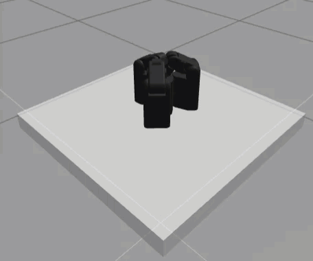
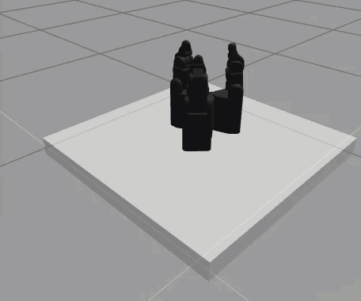

# shadow_smart_grasping
Dexterous grasping with the 9-DOF Gripper by Shadow Robot Company. 

### Commanding Joint Positions 
#### 1. Pre-Grasping Primitives

The `open_hand.py` script in the `open_hand_pkg` sends preset joint positions to each joint of the Shadow Hand gripper to place all three fingers of the gripper in an upright pose from a collapsed/nearly-clenched initial position. The `close_hand.py` script executes this motion in reverse. Joint positions can also be configured via the standard ROS ` rostopic pub` command in the Unix shell. A short demo for both cases is shown below:

 

